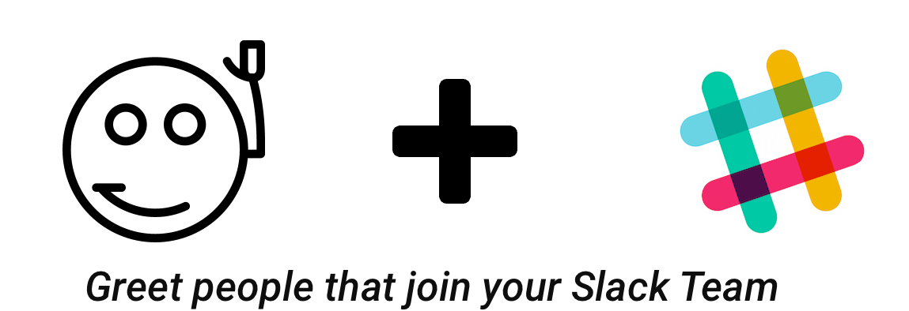

# Autogreater for Slack

A project that greets membrs that join your Slack Team(Workspace) that was developed during Google Code -In 2017 for CCExtractor Development

### Requirements

* Python
* Slack Client
* Logger

### Installation
` pip install requirements.txt`

### Getting Started:

* Create a bot user at https://my.slack.com/services/new/bot
* Fill out the `config.py`  file
* Run the bot.
* Invite it to '#general'

### The story of this bot

The bot uses the Slack's API and [Slack Client Library](https://github.com/slackapi/python-slackclient) for python to do all the communication with the server. 

It uses the [RTM or Real Time Messaging protocol](https://api.slack.com/rtm) and only cares about the `member_joined_channel` Response, since that is the one we are following to see if someone has joined the server. 

The bot is invited into `#general` and by default all new members join it. The `member_joined_channel` gives us the user object so we can DM them. The bot also has an option for welcoming in the channel if a Message is specified else it'll dm the user.

You can also notice a configuration file and a log file. That was made it so users can set it up easier and decreasing the risk of breaking the bot. The log option if a user has issue setting it up to easily share the log file and see what went wrong.

I've generated the API token from: https://my.slack.com/services/new/bot and gave it an Image and a Description so it looks much more friendlier and nicer to the Person who joins it and leaves a good Impression.
